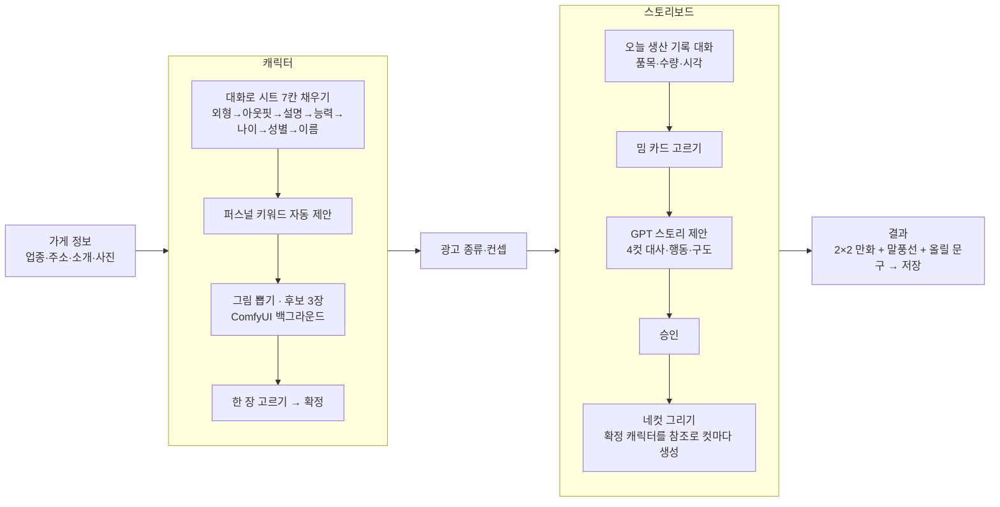
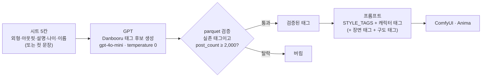
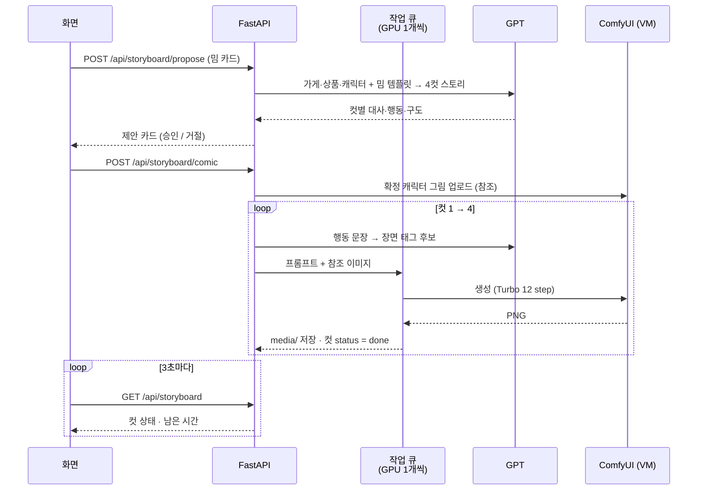

# Adflow — 마스코트 네컷 광고 만들기

빵집 사장님이 **가게 → 캐릭터 → 광고 → 스토리 → 네컷 그림**을 순서대로 채우면
밈 템플릿을 입힌 4컷 만화 광고가 나온다. 아래 그림 세 장이 전부다.

## 1. 전체 흐름 (화면 순서)



- 앞 단계가 안 끝나면 다음 단계 버튼이 잠긴다 (시트 미완 → 그림 못 뽑음, 캐릭터 미확정 → 네컷 못 그림).
- 그림 생성은 전부 백그라운드다. 요청은 바로 돌아오고 화면이 3초마다 상태를 받아 채운다.

## 2. 한국어 설명 → 그림 프롬프트

Anima는 Danbooru 태그로 학습된 모델이라 한국어 문장을 그대로 넣으면 얼버무린다.
그래서 **GPT가 태그 후보를 만들고, Danbooru 실제 태그 사전(parquet)으로 검증**한 것만 쓴다.



- 캐릭터 후보: `STYLE_TAGS + 캐릭터 태그` → `character_practice.json`
- 네컷 한 컷: `COMIC_STYLE_TAGS + 캐릭터 태그 + 장면 태그 + 구도 태그` → `comic_ipadapter_turbo.json`
  (확정한 그림 한 장을 IP-Adapter 참조로 넣어 캐릭터를 유지한다)
- 태그 사전: HuggingFace `deepghs/site_tags`의 `danbooru.donmai.us/tags.parquet` (`backend/data/danbooru_tags/`, git에 안 올림)

## 3. 네컷이 그려지는 순서



## 실행

```bash
# backend  (.env: DATABASE_URL, COMFY_BASE_URL, COMFY_USER/PASSWORD, OPENAI_API_KEY)
cd backend && pip install -r requirements.txt && uvicorn app.main:app --port 9010
# frontend (.env.local: VITE_API_PROXY_TARGET=http://127.0.0.1:9010)
cd frontend && npm install && npm run dev
```
