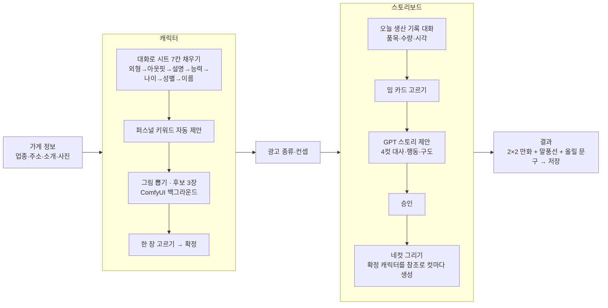
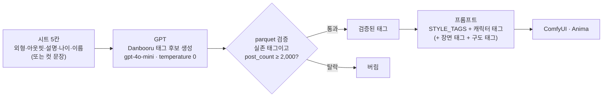
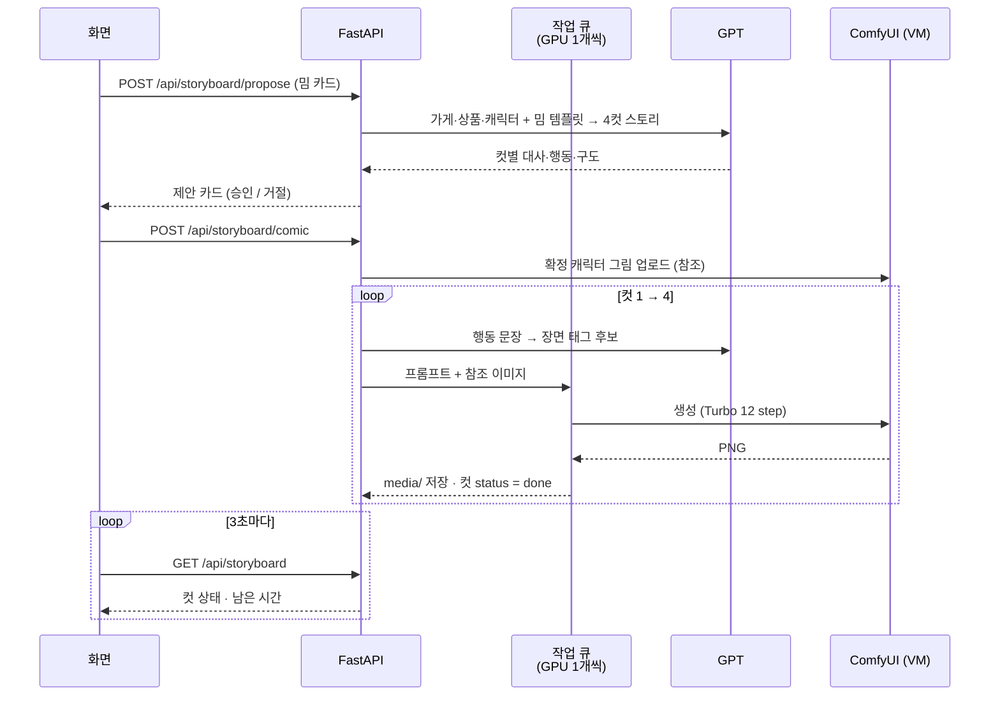
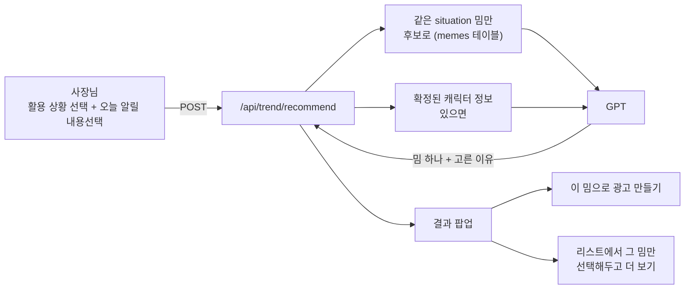

# Adflow — 마스코트 네컷 광고 만들기

빵집 사장님이 **가게 → 캐릭터 → 광고 → 스토리 → 네컷 그림**을 순서대로 채우면
밈 템플릿을 입힌 4컷 만화 광고가 나온다.

## 1. 전체 흐름 (화면 순서)



- 앞 단계가 안 끝나면 다음 단계 버튼이 잠긴다 (시트 미완 → 그림 못 뽑음, 캐릭터 미확정 → 네컷 못 그림).
- 그림 생성은 전부 백그라운드다. 요청은 바로 돌아오고 화면이 3초마다 상태를 받아 채운다.

## 2. 한국어 설명 → 그림 프롬프트

Anima는 Danbooru 태그로 학습된 모델이라 한국어 문장을 그대로 넣으면 얼버무린다.
그래서 **GPT가 태그 후보를 만들고, Danbooru 실제 태그 사전(parquet)으로 검증**한 것만 쓴다.



- 캐릭터 후보: `STYLE_TAGS + 캐릭터 태그` → `character_practice.json`
- 네컷 한 컷: `COMIC_STYLE_TAGS + 캐릭터 태그 + 장면 태그 + 구도 태그` → `comic_ipadapter_turbo.json`
  (확정한 그림 한 장을 IP-Adapter 참조로 넣어 캐릭터를 유지한다)
- 태그 사전: HuggingFace `deepghs/site_tags`의 `danbooru.donmai.us/tags.parquet` (`backend/data/danbooru_tags/`, git에 안 올림)

## 3. 네컷이 그려지는 순서



## 4. 밈 추천 (트렌드 확인 화면)

트렌드 확인 화면은 크롤링해 둔 밈을 훑어보는 화면이지만, 활용 상황(카테고리) 하나를 고르면
그 안에서 GPT가 밈 하나를 대신 골라주는 기능도 있다.



- 후보는 크롤링 밈(`memes` 테이블) 중 고른 활용 상황(`situation`)과 같은 것만 넘긴다.
- 캐릭터가 확정돼 있으면 이름·외형·아웃핏·능력·키워드·설명을 같이 넘겨서, 그 캐릭터와 어울리는 밈을 고르게 한다.
- 결과는 밈 하나와 "왜 골랐는지" 한국어 1~2문장. 바로 광고를 만들 수도 있고, 팝업의 밈을 눌러 트렌드 리스트에서 그 밈만 선택해둔 채로 유래·활용예시를 더 살펴볼 수도 있다.
- 밈 데이터 자체(`memes` 테이블)는 앱과 분리된 오프라인 파이프라인(`crawling/`)이 만든다 — 크롤링 → 문장 임베딩으로 상황 분류

## 배포

CI/CD 파이프라인은 없다. `main`에 PR을 머지한 뒤 VM에 직접 들어가 스크립트 하나를 돌리고 서비스를 재시작한다.

```bash
브라우저에서 JupyterLab 접속 (http://35.237.89.149/) → 터미널 열기
bash /home/sprint05/part4_3team/deploy.sh          # main pull → 프론트 빌드 → backend/app 교체
sudo systemctl restart adflow-backend adflow-frontend
systemctl is-active adflow-backend adflow-frontend  # 둘 다 active여야 한다
```

- `deploy.sh`는 `backend/.env` · `app.db` · `uploads/` · `media/`는 절대 안 건드린다 — 지우면 복구가 안 되는 것들이라 배포 자동화 대상에서 일부러 뺐다.


## 참고 자료

- [DB 스키마 (Adflow ERD)](https://claude.ai/code/artifact/f5766efd-aa09-4bfc-881f-29c77c536ee1)
- [Adflow 아키텍처](https://claude.ai/artifact/7Zb39jAHm9HfeGXuTXXUd2)
