# Adflow — 마스코트 네컷 광고 만들기

빵집 사장님이 **가게 → 캐릭터 → 광고 → 스토리 → 네컷 그림**을 순서대로 채우면
밈 템플릿을 입힌 4컷 만화 광고가 나온다.

## 시연

빈 상태에서 광고 한 편이 인스타에 올라갈 때까지를 배포 서버에서 그대로 녹화했다. 기다리는 구간은 2~6배속으로 줄였다.

**① 가게 정보** — 업종·주소·영업시간·소개를 적고 저장한다. 소개는 뒤에서 광고 문구와 마지막 컷 입간판에 그대로 쓰인다.

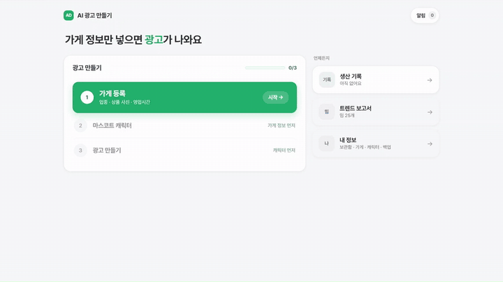

**② 캐릭터 · 대화로 시트 채우기 → 그림 뽑기** — 한 문장을 적으면 GPT가 칸에 맞춰 나눠 담고 확인 카드로 물어본다. 8칸이 차면 후보 3장을 뽑는다. (6배속)

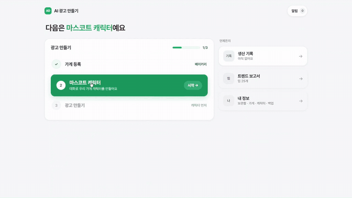

**③ 캐릭터 · 알아서 전부 만들기 → 확정** — 대화 대신 버튼 하나로 시트를 채우는 길. 후보를 크게 보고 한 장을 골라 확정한다. (3배속)

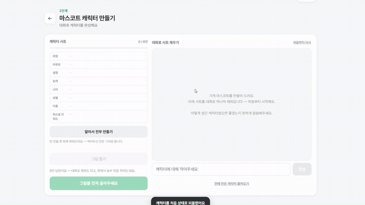

**④ 트렌드 · 밈 추천** — 가게와 캐릭터를 보고 어울리는 밈을 이유와 함께 권한다. 사장님이 고른 밈만 스토리에 들어간다. (3배속)

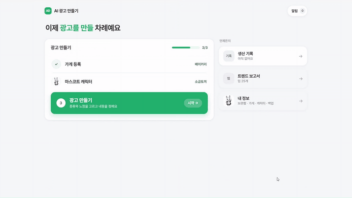

**⑤ 광고 종류·컨셉 → 알릴 내용 → 스토리 제안·승인** — 스토리를 여러 개 제안받아 하나를 고르면 컷 구성이 확정된다. (3배속)

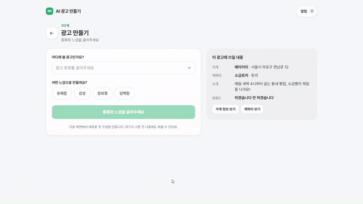

**⑥ 네컷 그리기** — 승인한 컷 구성을 확정 캐릭터를 참조로 컷마다 그린다. 화면은 3초마다 상태를 받아 칸을 채운다. (2배속)

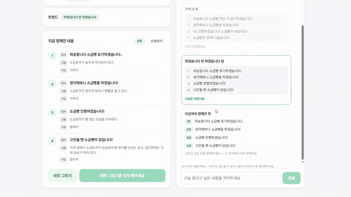

**⑦ 완성 → 인스타 올리기** — 말풍선을 구운 2×2 완성본과 올릴 문구. 내용을 확인한 뒤 인스타에 올린다. (2.5배속)

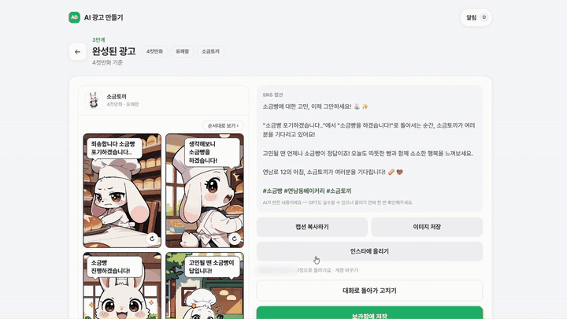

**⑧ 내 정보** — 홍보물·마스코트·생산 기록·가게 정보·백업. (2배속)

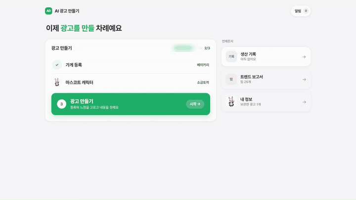

## 1. 전체 흐름 (화면 순서)

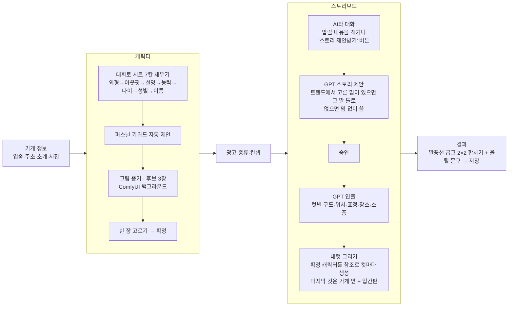
```mermaid
flowchart LR
    S[가게 정보<br/>업종·주소·소개·사진] --> C
    subgraph C[캐릭터]
        direction TB
        C1[대화로 시트 7칸 채우기<br/>외형→아웃핏→설명→능력→나이→성별→이름] --> C2[퍼스널 키워드 자동 제안]
        C2 --> C3[그림 뽑기 · 후보 3장<br/>ComfyUI 백그라운드]
        C3 --> C4[한 장 고르기 → 확정]
    end
    C --> A[광고 종류·컨셉]
    A --> SB
    subgraph SB[스토리보드]
        direction TB
        B1["AI와 대화<br/>알릴 내용을 적거나<br/>'스토리 제안받기' 버튼"] --> B2[GPT 스토리 제안<br/>트렌드에서 고른 밈이 있으면 그 말 틀로<br/>없으면 밈 없이 씀]
        B2 --> B3[승인]
        B3 --> B4[GPT 연출<br/>컷별 구도·위치·표정·장소·소품]
        B4 --> B5[네컷 그리기<br/>확정 캐릭터를 참조로 컷마다 생성<br/>마지막 컷은 가게 앞 + 입간판]
    end
    SB --> R[결과<br/>말풍선 굽고 2×2 합치기 + 올릴 문구 → 저장]
```

- 앞 단계가 안 끝나면 다음 단계 버튼이 잠긴다 (시트 미완 → 그림 못 뽑음, 캐릭터 미확정 → 네컷 못 그림).
- 그림 생성은 전부 백그라운드다. 요청은 바로 돌아오고 화면이 3초마다 상태를 받아 채운다.
- 밈은 사장님이 고른 것만 쓴다. 트렌드 화면에서 골라 왔거나, 대화에서 "밈 추천해줘"라고 해서(또는 버튼) GPT가 권한 밈을 **승인**했을 때만 스토리에 들어간다. 안 골랐으면 GPT는 밈 얘기를 꺼내지 않는다.

## 2. 한국어 설명 → 그림 프롬프트

Anima는 Danbooru 태그로 학습된 모델이라 한국어 문장을 그대로 넣으면 얼버무린다.
그래서 **GPT가 태그 후보를 만들고, Danbooru 실제 태그 사전(parquet)으로 검증**한 것만 쓴다.

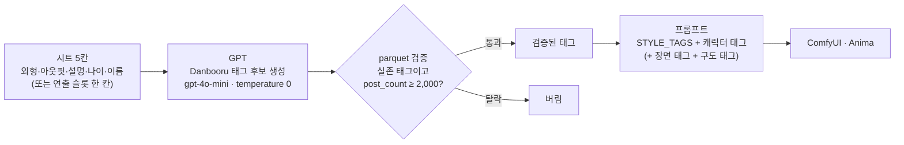
```mermaid
flowchart LR
    IN["시트 5칸<br/>외형·아웃핏·설명·나이·이름<br/>(또는 연출 슬롯 한 칸)"] --> GPT["GPT<br/>Danbooru 태그 후보 생성<br/>gpt-4o-mini · temperature 0"]
    GPT --> V{"parquet 검증<br/>실존 태그이고<br/>post_count ≥ 2,000?"}
    V -- 통과 --> OK[검증된 태그]
    V -- 탈락 --> DROP[버림]
    OK --> P["프롬프트<br/>STYLE_TAGS + 캐릭터 태그<br/>(+ 장면 태그 + 구도 태그)"]
    P --> ANIMA[ComfyUI · Anima]
```

- 캐릭터 후보: `STYLE_TAGS + 캐릭터 태그` → `character_practice.json`
- 네컷 한 컷: `COMIC_GLOBAL_TAGS + 캐릭터 태그 + 구도 태그 + 슬롯 태그` → `comic_ipadapter_turbo.json`
  (확정한 그림 한 장을 IP-Adapter 참조로 넣어 캐릭터를 유지한다)
  - 캐릭터 태그는 외형·아웃핏·나이 세 칸만 쓴다(성격·능력·키워드는 그림에 안 들어감). 네컷 시작 때 GPT 1회.
  - 구도 태그는 GPT 연출이 정한 샷 크기·앵글·인원·시선을 **표**로 바꾼다(GPT 안 거침). 위치(왼쪽·가운데·오른쪽)는 맞는 태그가 없어서 1216² 로 넓게 그린 뒤 832×1216 창을 그 쪽으로 잘라낸다.
  - 슬롯 태그는 표정·자세·장소·소품·빛 다섯 칸을 칸마다 GPT로 1~3개씩 뽑고 parquet 검증. 겹치는 태그는 한 번만.
  - 연출 결과가 없을 때(GPT 없음)만 옛 경로(`comic_prompt`: 행동 문장 → 장면 태그)로 떨어진다.
- 태그 사전: HuggingFace `deepghs/site_tags`의 `danbooru.donmai.us/tags.parquet` (`backend/data/danbooru_tags/`, git에 안 올림)

## 3. 네컷이 그려지는 순서

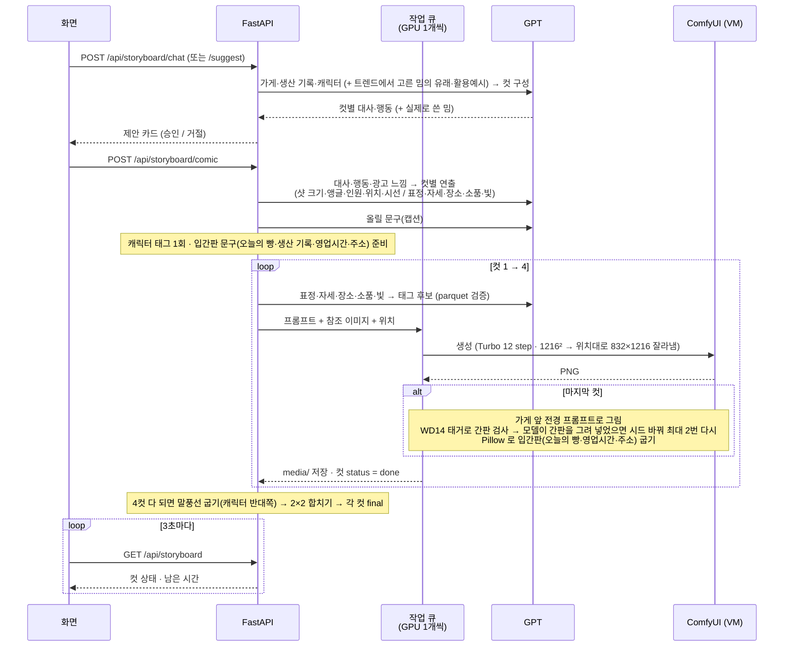
```mermaid
sequenceDiagram
    participant U as 화면
    participant API as FastAPI
    participant J as 작업 큐<br/>(GPU 1개씩)
    participant G as GPT
    participant CF as ComfyUI (VM)

    U->>API: POST /api/storyboard/chat (또는 /suggest)
    API->>G: 가게·생산 기록·캐릭터 (+ 트렌드에서 고른 밈의 유래·활용예시) → 컷 구성
    G-->>API: 컷별 대사·행동 (+ 실제로 쓴 밈)
    API-->>U: 제안 카드 (승인 / 거절)
    U->>API: POST /api/storyboard/comic
    API->>G: 대사·행동·광고 느낌 → 컷별 연출<br/>(샷 크기·앵글·인원·위치·시선 / 표정·자세·장소·소품·빛)
    API->>G: 올릴 문구(캡션)
    Note over API: 캐릭터 태그 1회 · 입간판 문구(오늘의 빵·생산 기록·영업시간·주소) 준비
    loop 컷 1 → 4
        API->>G: 표정·자세·장소·소품·빛 → 태그 후보 (parquet 검증)
        API->>J: 프롬프트 + 참조 이미지 + 위치
        J->>CF: 생성 (Turbo 12 step · 1216² → 위치대로 832×1216 잘라냄)
        CF-->>J: PNG
        alt 마지막 컷
            Note over J,CF: 가게 앞 전경 프롬프트로 그림<br/>WD14 태거로 간판 검사 → 모델이 간판을 그려 넣었으면 시드 바꿔 최대 2번 다시<br/>Pillow 로 입간판(오늘의 빵·영업시간·주소) 굽기
        end
        J-->>API: media/ 저장 · 컷 status = done
    end
    Note over API: 4컷 다 되면 말풍선 굽기(캐릭터 반대쪽) → 2×2 합치기 → 각 컷 final
    loop 3초마다
        U->>API: GET /api/storyboard
        API-->>U: 컷 상태 · 남은 시간
    end
```

- 마지막 컷의 가게 정보는 대사가 아니라 코드가 그린 입간판으로 보여준다. Anima 는 한글을 못 쓰기 때문(직접 그리게 하면 낙서가 된다).
- 한 편의 모든 단계(스토리 GPT → 연출 → 슬롯별 태그 → 사전 검증 → 그림 → 간판 검사 → 굽기)는 `backend/traces/<run_id>.jsonl` 에 남고, `/api/debug/trace/<run_id>/view`(`latest` 가능)에서 표로 본다.


## 배포

CI/CD 파이프라인은 없다. `main`에 PR을 머지한 뒤 VM에 직접 들어가 스크립트 하나를 돌리고 서비스를 재시작한다.

```bash
브라우저에서 JupyterLab 접속 (http://35.237.89.149/) → 터미널 열기
bash /home/sprint05/part4_3team/deploy.sh          # main pull → 프론트 빌드 → backend/app 교체
sudo systemctl restart adflow-backend adflow-frontend
systemctl is-active adflow-backend adflow-frontend  # 둘 다 active여야 한다
```

- `deploy.sh`는 `backend/.env` · `app.db` · `uploads/` · `media/`는 절대 안 건드린다 — 지우면 복구가 안 되는 것들이라 배포 자동화 대상에서 일부러 뺐다.


## 참고 자료

- [DB 스키마](https://claude.ai/artifact/4Cv9aUkDpNSAz3ZsiNna3f)
- [아키텍처](https://claude.ai/artifact/PddYfocaidTkFWb2Sfi8Aj)
- [API 앤드포인트 목록](https://claude.ai/artifact/H2uyDeHBhkDo3LgHTZ5pDn)

## 폴더 구조

```
part4_3team/
├── backend/                  # FastAPI 서버
│   ├── app/
│   │   ├── api/routes/       # 라우터 — store·character·trend·ad·storyboard·production·history (+ 개발용 debug)
│   │   ├── services/         # 서비스 14개 — GPT(sheet_llm·story_llm·director·meme_recommend)·
│   │   │                     #   그림(chat_ai·danbooru_tags·danbooru_lookup·image_gen·sign_check·comic_bake)·
│   │   │                     #   기타(character_sheet·jobs·instagram·trace)
│   │   │   └── workflows/     # ComfyUI 워크플로 JSON (캐릭터·네컷)
│   │   ├── core/              # 설정(config.py), DB 세션(database.py)
│   │   ├── db/seed.py         # 싱글턴 행 초기화
│   │   ├── models.py          # SQLAlchemy 모델
│   │   ├── schemas.py         # Pydantic 스키마
│   │   └── main.py            # 앱 진입점, 라우터·정적 파일 마운트
│   ├── import_memes.py       # crawling/의 memes_all.json을 memes 테이블에 적재
│   ├── requirements.txt
│   └── app.db                 # SQLite (git에 안 올림)
├── frontend/                  # React + Vite
│   └── src/
│       ├── screens/           # 화면별 컴포넌트 — Home·Store·Character·CharacterInfo·Trend·Ad·Storyboard·Result·InstagramSetup·MyStore·My/
│       ├── components/        # 공용 UI — AppShell·ChatPanel·ComicPanels·ImageSlot·Lightbox·bubbles/·ui/(Button·Field)
│       ├── state/useAdMakerState.js  # 전역 상태 훅 하나
│       ├── api/client.js      # 백엔드 호출 래퍼
│       ├── lib/               # 광고 문구·다운로드·상황 라벨 도우미
│       └── theme.js           # 색상·타이포 토큰
├── crawling/                  # 밈 크롤링 파이프라인 (앱과 분리, 사람이 직접 실행)
│   ├── meme_pipeline.py       # 한 사이클 실행: 수집 → 중복 묶기 → DB 적재 → 상황 분류 → 유행 기간
│   ├── pipeline_sources.py    # 밈 사이트 3곳 수집
│   ├── pipeline_dedupe.py     # 사이트 간 중복 밈 묶기 (TF-IDF)
│   ├── classify_memes_situation.py  # OpenAI 임베딩으로 활용 상황 분류
│   ├── naver_trend.py         # 네이버 검색어트렌드로 유행 기간 측정
│   ├── memes_all.json         # 크롤링 결과(중복 병합 완료본)
│   └── images/                # 밈 대표 이미지 — /api/meme-images/로 직접 서빙
├── deploy/                    # 배포 스크립트, VM에서 사람이 직접 할 일 문서
│   ├── ship.sh                # rebase → push → 배포 → 재시작 → 확인을 순서대로
│   ├── deploy_from_github.sh  # VM에서 도는 실제 배포 스크립트 (main pull → 빌드 → 교체)
│   ├── set_openai_key.sh      # 서버 설정 파일에 OpenAI 키 넣기
│   ├── reset_service_data.py  # 서비스를 처음 쓰는 상태로 되돌림 (데모 데이터 삭제)
│   └── USER_COMMANDS.md       # 서비스 재시작 등 자동화 안 된 절차
└── README.md
```

## 기술 스택

| 구분 | 기술 | 용도 |
| --- | --- | --- |
| Frontend | React 18 · Vite 5 | 화면 구성, `fetch`로 백엔드 호출 |
| Backend | FastAPI 0.115 · Uvicorn | REST API 서버 |
| ORM · 검증 | SQLAlchemy 2.0 · Pydantic 2 · pydantic-settings | DB 모델, 입출력 스키마, `.env` 설정 |
| Database | SQLite | 가게·캐릭터·스토리보드·생산기록·밈 저장 |
| 파일 저장 | 서버 로컬 폴더 (`media/`, `uploads/`) | 생성 이미지, 업로드 사진 |
| LLM | OpenAI (gpt-4o-mini · gpt-4o · gpt-5-mini) | 시트 대화, 스토리·캡션 생성, 연출, 밈 추천 |
| 이미지 생성 | ComfyUI (Anima 모델, IP-Adapter 워크플로) | 캐릭터 후보·네컷 이미지 생성 |
| 이미지 후처리 | Pillow | 말풍선·입간판 합성, 2×2 네컷 합치기 |
| 태그 검증 | pyarrow + Danbooru 태그 사전(parquet) | 그림 프롬프트 태그 검증 |
| 간판 검사 | WD14 태거 (ONNX, 선택 기능) | 마지막 컷에 간판이 그려졌는지 검사 |
| 외부 API | Instagram Graph API · 네이버 검색어트렌드 API | 인스타 게시, 밈 유행 기간 측정 |
| 크롤링 | requests · HTMLParser · OpenAI 임베딩 | 밈 수집, 활용 상황 분류 |
| 배포 | GCP Compute Engine VM + nginx + systemd (`adflow-backend`, `adflow-frontend`) | nginx가 경로별로 전달, 수동 배포 스크립트 (`deploy/`) |

## 협업일지

- [전재완](docs/협업일지-전재완.md) — ComfyUI 워크플로우 · 캐릭터 일관성. 날짜를 누르면 그날 일지가 펼쳐진다.
